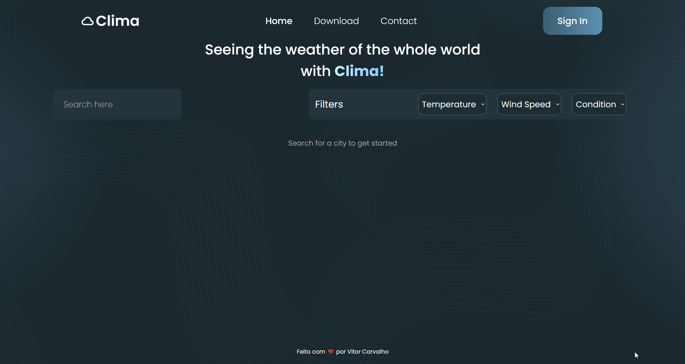

<h1 align="center">🌦️ Clima </h1>

<p align="center">
    Projeto com foco na consolidação do conhecimento na responsividade, no JavaScript, e no consumo de APIS.
</p>

<p align="center">
  <a href="#-Projeto">Projeto</a>&nbsp;&nbsp;&nbsp;|&nbsp;&nbsp;&nbsp;
  <a href="#-Tecnologias">Tecnologias</a>&nbsp;&nbsp;&nbsp;|&nbsp;&nbsp;&nbsp;
  <a href="#-Funcionalidades">Funcionalidades</a>&nbsp;&nbsp;&nbsp;|&nbsp;&nbsp;&nbsp;
  <a href="#-Executar">Executar</a>&nbsp;&nbsp;&nbsp;|&nbsp;&nbsp;&nbsp;
  <a href="#-Deploy">Deploy</a>
</p>

<br>

<p align="center">
  
</p>

## 💻 Projeto

Bem-vindo ao Clima! Esta é uma aplicação web interativa que permite aos usuários pesquisar o clima de cidades ao redor do mundo em tempo real. Os dados são consumidos da API <a href="https://openweathermap.org/api">OpenWeatherMap</a> e apresentados em cartões informativos e com um design agradável.

## 🚀 Tecnologias

<div>
    
    
    
    
    
    
    
</div>

## ✨ Funcionalidades

- **Busca dinâmica:** Pesquise por qualquer cidade do mundo e obtenha os dados meteorológicos instantaneamente.
- **Cartões de clima detalhados:** Visualize informações como temperatura, velocidade do vento, condição do tempo e horário local.
- **Ícones intuitivos:** Ícones que mudam conforme a condição do tempo (ensolarado, nublado, chuvoso).
- **Filtros avançados:** Refine sua busca com filtros de temperatura (quente, ameno, frio), velocidade do vento e condição climática.
- **Design responsivo:** A aplicação se adapta perfeitamente a diferentes tamanhos de tela, de desktops a dispositivos móveis.
- **Bandeiras dos países:** Identificação visual rápida do país da cidade pesquisada usando a <a href="https://flagsapi.com/">Country Flags Api</a>.

## ⚙️ Executar

Para executar o projeto localmente, siga os passos abaixo:

1. **Clone o repositório:**

```bash
git clone https:github.com/euvitorcarvalho/clima.git
cd clima
```

2. **Instale as dependências:**

```bash
npm install
```

3. **Configure as variáveis de ambiente:**

- Crie um arquivo chamado `.env` na raiz do projeto.
- Dentro desse arquivo, adicione sua chave da API da OpenWeatherMap, como no exemplo abaixo:

```js
VITE_API_KEY = sua_chave_de_api_aqui;
```

4. **Inicie o servidor de desenvolvimento:**

```bash
npm run dev
```

A aplicação estará disponível na porta indicada pelo Vite.

## 🔖 Deploy

Você pode visualizar e testar o projeto através [desse link](https://climacities.netlify.app/).
